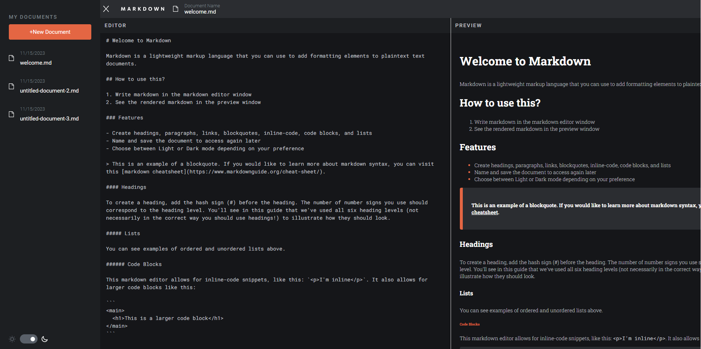
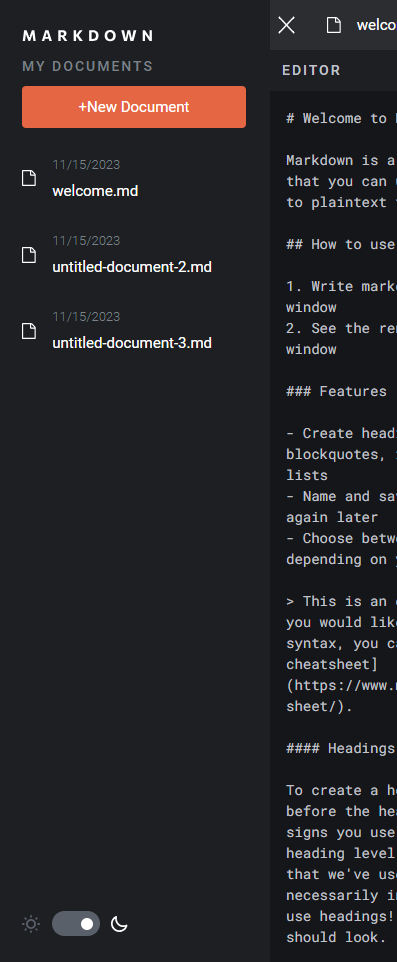
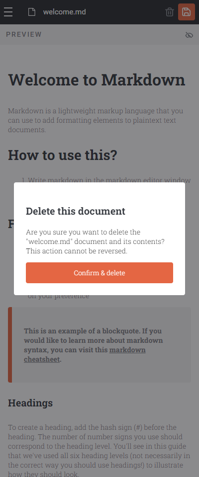
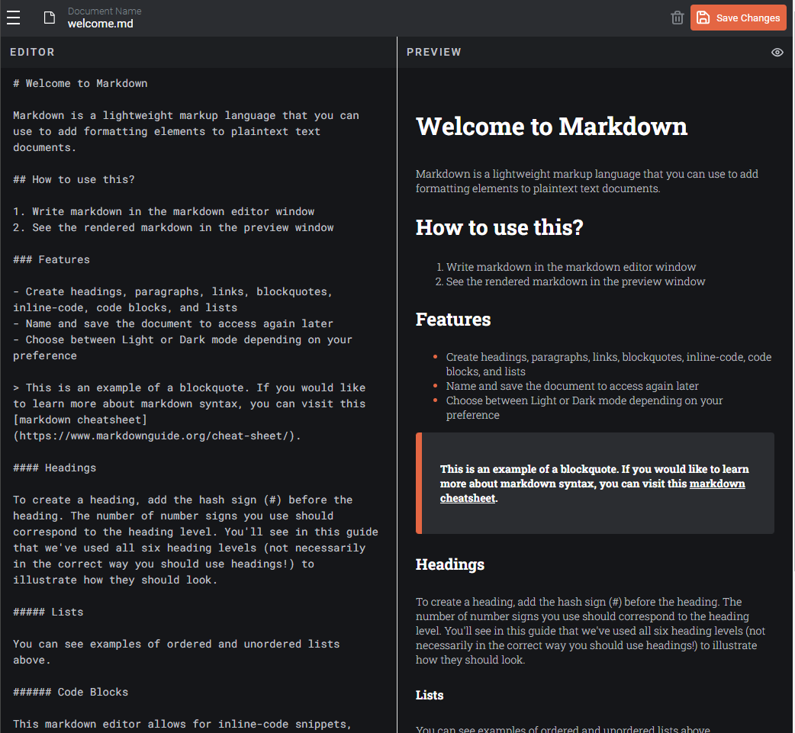

# In-browser markdown editor

## Table of contents

-   [Overview](#overview)
    -   [The challenge](#the-challenge)
    -   [Screenshot](#screenshot)
    -   [Links](#links)
-   [Installation and Usage](#installation-and-usage)
-   [Folder Structure](#folder-structure)

-   [Future Enhancements](#author)
-   [Contributions](#contributions)

## Overview

Welcome to the repository for an in-browser Markdown editor developed using React and Redux JavaScript libraries. This editor empowers users with capabilities to create, read, update, and delete documents, rename and save documents, edit Markdown content, and visualize formatted previews. By default, the editor seamlessly transitions between dark and light modes based on system settings, offering a personalized experience. Markdown documents created are saved locally, ensuring seamless access across browser sessions.

### Screenshot

.[Tablet Light Mode](./screenshots/Tablet-light-2.png)

### Links

-   Solution URL: [Markdown-Editor-Code](https://github.com/joeehis1/markdown-editor)
-   Live Site URL: [Markdown-Editor-Deployed](https://venerable-belekoy-9692bc.netlify.app/)

## Installation and Usage

As an in-browser application, there is no installation required. Upon accessing the site, users are presented with Markdown text alongside an icon to toggle between text and preview modes. A menu button on the top left corner unveils a populated list of documents, allowing users to effortlessly manage their content. Markdown text updates automatically reflect in the preview pane. Documents are saved automatically, ensuring seamless continuity across sessions. Users can rename documents by clicking on the label in the top panel, revealing a form for input. Saving is accomplished by pressing "Enter" or clicking the save button. The editor also offers document deletion functionality, including a modal for confirmation. Additionally, the editor adapts to system settings, providing users with a default light or dark mode. This can be customized via the toggle button within the menu.

## Folder Structure

-   Components: Includes all components used in the application, organized into header and Markdown display sections. Redux slice files manage state values for each Markdown document.
-   Context: Contains context code for managing navbar and logo location state values.
-   Hook: Includes a viewport width check hook.
-   SCSS: Contains CSS styles for various application elements.
-   App.jsx: Acts as the entry point for the application.
-   main.jsx: Declaration for all React applications.
-   Store.js: Configuration for the Redux store.

## Future Enhancements

In the future, I aim to transform the Markdown editor into a full-stack application using the Remix framework.

## Contributions

Contributions to this project are highly valued. Simply fork the repository and submit a pull request to get started.
